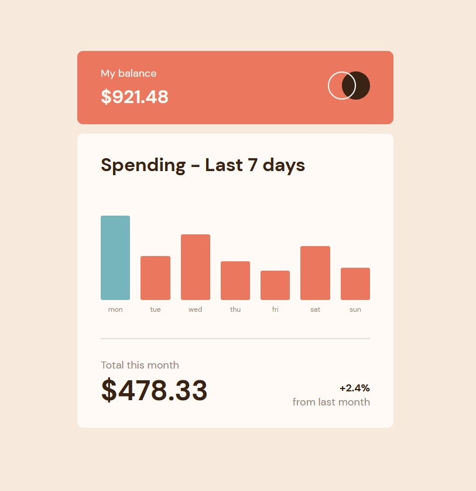

# Expense Chart App

### Author: Hunter Bernier

## **_Webpage Link:_**

[Expense Chart](https://hmbernier55.github.io/Expense-Chart/)

## **_Webpage Screenshot:_**

## **_Description:_**

My interpretation of a [Frontend Mentor](https://www.frontendmentor.io/home) Challenge

### The user can:

- View the bar chart and hover over the individual bars to see the correct amounts for each day
- See the current day's bar highlighted in cyan
- View the optimal layout for the content depending on their device's screen size
- See hover states for all interactive elements on the page
- See dynamically generated bars based on the data provided in the local JSON file

## **_My process:_**

### Built with:

- Semantic HTML5 markup
- CSS custom properties
- Flexbox
- CSS Grid
- Mobile-first workflow
- Vanilla JS
